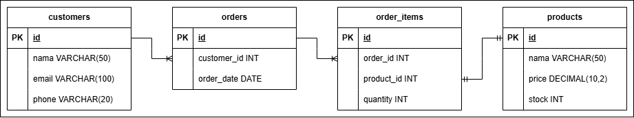

# Database Toko Elektronika

Proyek ini adalah desain dan implementasi database untuk sebuah toko elektronika. Database ini bertujuan untuk mengelola data produk, pelanggan dan pesanan secara efektif dan efisien.

## Deskripsi

Database toko elektronika ini dirancang untuk menyimpan informasi terkait produk elektronik, data pelanggan, dan detail pesanan. Dengan menggunakan database ini, toko dapat mengelola inventaris, dan melacak pesanan dengan lebih baik.

## Fitur Utama

- **Manajemen Produk:** Menyimpan informasi detail tentang produk elektronik yang dijual.
- **Manajemen Pelanggan:** Menyimpan data pelanggan untuk keperluan penjualan dan pemasaran.
- **Manajemen Pesanan:** Melacak pesanan yang dibuat oleh pelanggan.

## Skema Database

### Pada rancangan database diatas terdapat 4 tabel  
1. **customers**: untuk mendata setiap pelanggan yang berbelanja di toko.
2. **products**: untuk mendata setiap produk yang dijual di toko.
3. **orders**: untuk mendata setiap pesanan yang dilakukan customers.
4. **orders_items**: untuk mendata setiap produk yang dibeli dalam orders.  

### Relasi
1. **customers** berelasi 1 - M dengan **orders** 
1. **orders** berelasi 1 - M dengan **order_items** 
1. **order_items** berelasi 1 - 1 dengan **products** 

### Trigger
pada proyek ini terdapat 3 buah trigger untuk "menyesuaikan" stok pada tabel **produk** ketika melakukan INSERT/UPDATE/DELETE ke **order_items**

1. Ketika melakukan INSERT ke **order_items** maka kurangkan stok pada tabel **products** sejumlah quantity yang diinputkan  
>

2. Ketika melakukan UPDATE ke **order_items** maka kurangkan stok pada tabel **products** sejumlah selisih dari quantity lama dan baru  
>

3. Ketika melakukan DELETE ke **order_items** maka kembalikan stok ke tabel **products** sesuai jumlah quantity  
>

### View
Pada proyek ini terdapat 2 view yang sekiranya akan membantu pemilik toko  
1. View untuk menampikan jumlah total harga order yang dilakukan per 1 **orders**  
>

1. View untuk menampikan data **orders** yang memiliki 5 **order_items**  
>

### Select
sekiranya pemilik toko ingin mencari **orders** yang dilakukan **customers** tetapi yang diketahui sebagian dari nama **customers**, maka bisa gunakan query berikut:  
>

Identitas Diri:  
>Nama : 'nama'  
>NIM : 'NIM'  
>Kelas : 'kelas'

